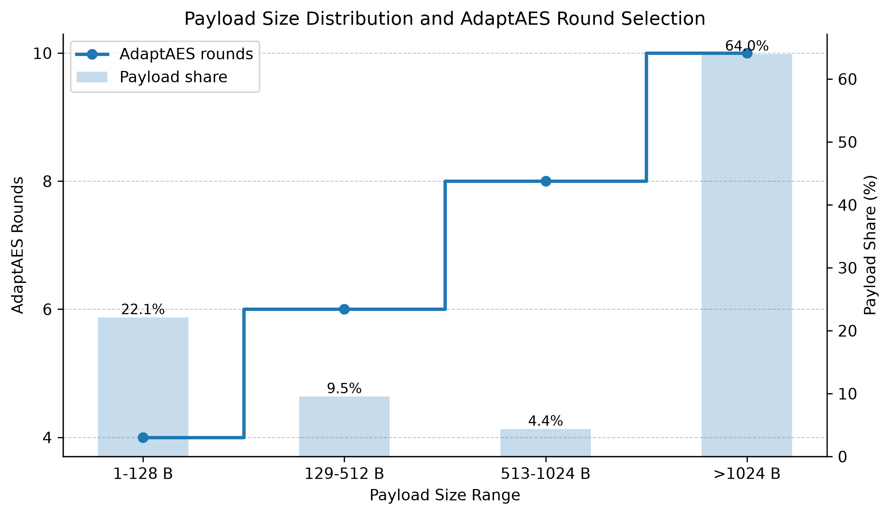
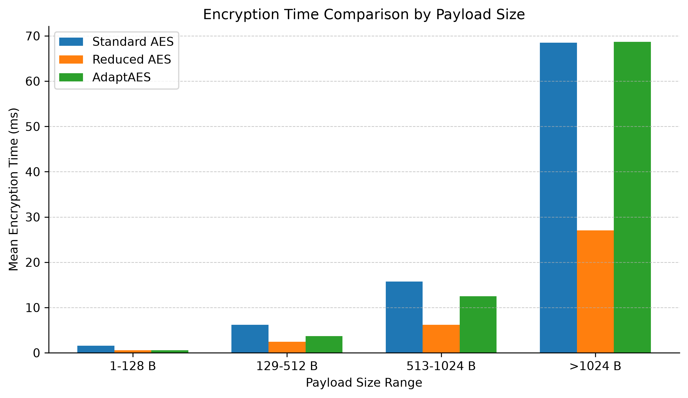
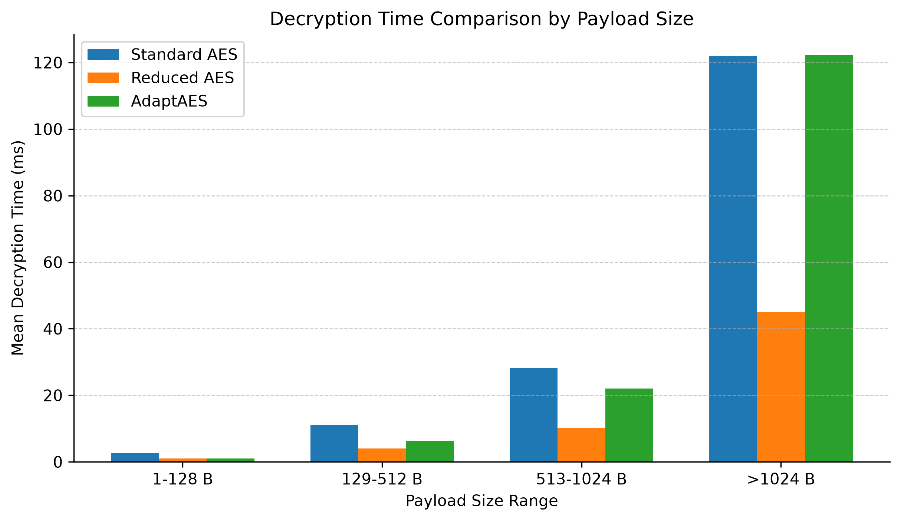
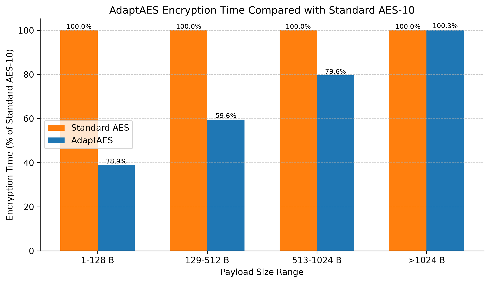
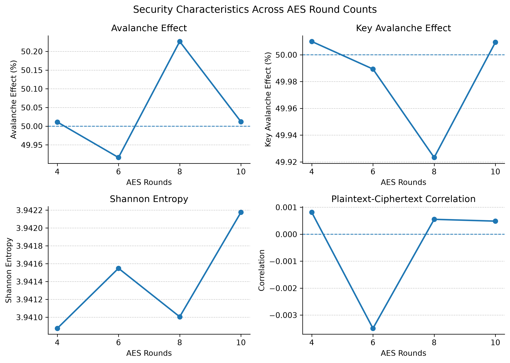

# AdaptAES: Packet-Size Adaptive Round Reduction for AES

## 1. Project Overview

**AdaptAES** is an information security lab project that evaluates whether AES encryption time can be reduced for network-traffic payloads by dynamically selecting the number of AES rounds according to packet payload size.

The project compares three encryption approaches:

| Method | Description |
|---|---|
| Standard AES | AES-128 style encryption using 10 rounds for every payload |
| Reduced AES | Fixed lightweight AES variant using 4 rounds for every payload |
| AdaptAES | Adaptive AES variant using 4, 6, 8, or 10 rounds based on payload length |

The main idea is not to claim that reduced-round AES is cryptographically equivalent to full AES. Instead, the project measures:

- packet payload size distribution from real PCAP traffic
- encryption and decryption time
- throughput
- time reduction compared with Standard AES-10
- selected statistical security indicators, including avalanche effect, key avalanche effect, entropy, chi-square, byte-frequency distribution, and plaintext-ciphertext correlation

The project uses PCAP-derived payload lengths rather than a purely synthetic dataset. Since the PCAPs are anonymized/truncated and may not preserve original application payload bytes, synthetic plaintext payloads are generated with the same extracted payload lengths. This preserves the traffic-size behavior required for AdaptAES evaluation.

## 2. Problem Statement

AES is widely used for secure communication, but standard AES-128 applies a fixed 10-round structure to every block of data. This means that a very small packet and a very large payload are both processed using the same round count. Prior reduced-round AES research shows that fewer rounds can improve performance, but many reduced-round approaches use one fixed reduced round count for all inputs.

AdaptAES investigates a packet-size-aware alternative:

- small payloads use fewer rounds to reduce encryption/decryption time
- medium payloads use intermediate rounds
- very large payloads use full 10-round AES

The goal is to evaluate whether this adaptive policy provides a useful performance improvement while maintaining statistical ciphertext characteristics close to standard AES in the selected tests.

## 3. Scope and Research Framing

This project is a lab-scale implementation and evaluation, not a full cryptanalytic proof.

The project can support the following claim:

> AdaptAES improves encryption/decryption performance for smaller payload ranges while producing ciphertext statistical indicators close to Standard AES under the selected tests.

The project should not claim:

> Reduced-round AES is as cryptographically secure as full AES-128.

Full cryptanalytic security would require deeper attacks and analysis, such as differential cryptanalysis, linear cryptanalysis, related-key attacks, impossible differential attacks, or formal security proofs. Those are outside the current implementation scope.

## 4. Dataset and Traffic Source

The project uses anonymized HIKARI-style PCAP traffic files stored locally under:

```text
data/raw/
```

The extracted result files are stored under:

```text
results/extracted/
```

The PCAP extraction stage parsed TCP/UDP IPv4 packet headers and recovered the original transport-layer payload lengths. Payload length is the key field required for AdaptAES because the adaptive round policy depends on payload size.

## 5. Dataset Summary

The extracted dataset contains six PCAP files:

| Dataset | Total Packets | Payload Packets | Payload % | TCP | UDP |
|---|---:|---:|---:|---:|---:|
| Monday_2021-03-29.anonymized | 344,106 | 169,523 | 49.26% | 329,814 | 14,272 |
| Saturday_2021-04-10_1628.anonymized | 533,848 | 278,895 | 52.24% | 505,583 | 27,826 |
| Saturday_2021-05-01_0520.anonymized | 1,888,936 | 997,156 | 52.79% | 1,803,153 | 85,272 |
| Sunday_2021-03-28.anonymized | 523,335 | 268,700 | 51.34% | 499,118 | 24,113 |
| Tuesday_2021-03-30.anonymized | 651,203 | 324,445 | 49.82% | 623,118 | 27,584 |
| Wednesday_2021-04-07.anonymized | 646,548 | 316,332 | 48.93% | 601,856 | 43,963 |
| **TOTAL** | **4,587,976** | **2,355,051** | **51.33%** | **4,362,642** | **223,030** |

## 6. AdaptAES Round Policy

AdaptAES selects AES rounds according to payload size:

| Payload Range | Packet Count | Dataset Share | AdaptAES Rounds |
|---|---:|---:|---:|
| Small, 1-128 B | 502,232 | 21.33% | 4 |
| Medium, 129-512 B | 213,169 | 9.05% | 6 |
| Large, 513-1024 B | 93,739 | 3.98% | 8 |
| Very Large, >1024 B | 1,545,911 | 65.64% | 10 |

This policy means AdaptAES behaves like reduced AES for very small packets, but returns to full AES-10 for very large payloads.

## 7. Implementation Structure

The implementation is organized into scripts and result folders.

### 7.1 Core AES Scripts

| File | Purpose |
|---|---|
| `scripts/aes_core.py` | AES implementation with configurable round count |
| `scripts/aes_reduced.py` | Fixed 4-round reduced AES wrapper |
| `scripts/aes_adaptive.py` | AdaptAES round-selection and encryption/decryption wrapper |
| `scripts/test_aes.py` | Basic AES correctness and behavior tests |

### 7.2 Dataset Extraction and Payload Generation

| File | Purpose |
|---|---|
| `scripts/extract_payload_lengths.py` | Extracts packet metadata and TCP/UDP payload lengths from one PCAP |
| `scripts/batch_extract_payload_lengths.py` | Runs extraction over all PCAP files |
| `scripts/generate_plaintext_payloads.py` | Generates deterministic synthetic plaintext payloads matching extracted lengths |
| `scripts/validate_generated_payloads.py` | Checks that generated payloads match the extracted length requirements |

### 7.3 Benchmarking and Analysis

| File | Purpose |
|---|---|
| `scripts/benchmark_dataset_timings.py` | Measures encryption/decryption time for Standard AES, Reduced AES, and AdaptAES |
| `scripts/security_evaluation.py` | Computes selected statistical security indicators |
| `scripts/security_performance_analysis.py` | Combines timing and statistical security analysis |
| `scripts/print_research_results.py` | Prints dataset and timing result tables |
| `scripts/print_analysis_results.py` | Prints combined timing and statistical indicator result tables |
| `scripts/generate_graphs.py` | Generates research graphs from existing CSV result files |

### 7.4 Result Directories

| Directory | Contents |
|---|---|
| `results/extracted/` | Extracted payload length CSVs and per-PCAP summaries |
| `results/payloads/` | Generated plaintext payload binaries and summaries |
| `results/timings/` | Encryption/decryption benchmark CSV and JSON summaries |
| `results/security/` | Security metric summaries from the first statistical evaluation script |
| `results/analysis/` | Combined timing and statistical analysis output |
| `results/plots/` | Generated research graphs |

## 8. Methodology

### 8.1 PCAP Extraction

For each PCAP, the extraction script reads packet headers and extracts:

- packet ID
- timestamp
- protocol
- source and destination
- TCP/UDP header information
- payload length
- AdaptAES round count selected from payload length

The most important field for this project is `payload_length`.

### 8.2 Synthetic Payload Generation

Because the downloaded PCAPs are anonymized and contain messages such as "packet size limited during capture", the project does not assume that original plaintext payload bytes are recoverable. Instead, it generates synthetic plaintext payloads with the exact same payload length distribution.

This means:

- the benchmark uses realistic network payload sizes
- AES receives inputs with the same length distribution as the PCAP traffic
- timing results reflect packet-size behavior from real traffic
- no sensitive original payload content is needed

### 8.3 Encryption Methods

Each generated payload is processed through:

1. **Standard AES**
   - 10 rounds for every payload

2. **Fixed Reduced AES**
   - 4 rounds for every payload

3. **AdaptAES**
   - 4 rounds for 1-128 B
   - 6 rounds for 129-512 B
   - 8 rounds for 513-1024 B
   - 10 rounds for >1024 B

### 8.4 Timing Benchmark

For each method, the benchmark measures:

- encryption time
- decryption time
- throughput
- speedup relative to AES-10
- time reduction relative to AES-10

The timing benchmark used 300 payloads in total for the summarized timing tables, grouped by payload range.

### 8.5 Statistical Security Indicators

The statistical analysis measures:

| Metric | Meaning |
|---|---|
| Avalanche Effect | How much ciphertext changes when one plaintext bit changes |
| Key Avalanche Effect | How much ciphertext changes when one key bit changes |
| Shannon Entropy | Randomness/unpredictability of ciphertext bytes |
| Byte Frequency Distribution | Spread of ciphertext byte values |
| Chi-Square | Uniformity of byte distribution |
| Correlation Coefficient | Linear relationship between plaintext and ciphertext bytes |

These metrics indicate diffusion and ciphertext randomness behavior. They do not prove resistance to cryptanalytic attacks.

## 9. Timing Results

### 9.1 Overall Timing Comparison

| Method | Rounds | Payloads | Mean Enc Time (ms) | Mean Dec Time (ms) | Mean Throughput (MB/s) | Enc Speedup | Enc Time Reduction | Dec Speedup | Dec Time Reduction |
|---|---:|---:|---:|---:|---:|---:|---:|---:|---:|
| Standard AES | 10 | 300 | 48.34 | 86.06 | 0.04 | 1.00x | 0.00% | 1.00x | 0.00% |
| Reduced AES | 4 | 300 | 19.10 | 31.68 | 0.10 | 2.53x | 60.50% | 2.72x | 63.19% |
| AdaptAES | 4/6/8/10 | 300 | 47.91 | 85.29 | 0.05 | 1.01x | 0.88% | 1.01x | 0.89% |

Overall, AdaptAES is close to Standard AES because the dataset is dominated by very large payloads, and AdaptAES uses full 10-round AES for the very large range.

### 9.2 Timing by Payload Range

| Payload Range | Method | Payloads | Avg Size (B) | Avg Rounds | Mean Enc (ms) | Mean Dec (ms) | Enc Reduction vs AES-10 | Dec Reduction vs AES-10 |
|---|---|---:|---:|---:|---:|---:|---:|---:|
| Small, 1-128 B | Standard AES | 53 | 58.30 | 10 | 1.54 | 2.71 | 0.00% | 0.00% |
| Small, 1-128 B | Reduced AES | 53 | 58.30 | 4 | 0.60 | 0.99 | 61.05% | 63.46% |
| Small, 1-128 B | AdaptAES | 53 | 58.30 | 4 | 0.60 | 0.99 | 61.11% | 63.38% |
| Medium, 129-512 B | Standard AES | 24 | 269.62 | 10 | 6.19 | 11.05 | 0.00% | 0.00% |
| Medium, 129-512 B | Reduced AES | 24 | 269.62 | 4 | 2.42 | 4.02 | 60.83% | 63.59% |
| Medium, 129-512 B | AdaptAES | 24 | 269.62 | 6 | 3.69 | 6.38 | 40.44% | 42.24% |
| Large, 513-1024 B | Standard AES | 19 | 691.16 | 10 | 15.72 | 28.20 | 0.00% | 0.00% |
| Large, 513-1024 B | Reduced AES | 19 | 691.16 | 4 | 6.20 | 10.21 | 60.55% | 63.80% |
| Large, 513-1024 B | AdaptAES | 19 | 691.16 | 8 | 12.51 | 22.05 | 20.42% | 21.82% |
| Very Large, >1024 B | Standard AES | 204 | 3064.64 | 10 | 68.49 | 121.93 | 0.00% | 0.00% |
| Very Large, >1024 B | Reduced AES | 204 | 3064.64 | 4 | 27.06 | 44.90 | 60.49% | 63.17% |
| Very Large, >1024 B | AdaptAES | 204 | 3064.64 | 10 | 68.70 | 122.36 | -0.31% | -0.36% |

## 10. Statistical Security Indicator Results

### 10.1 Round-Wise Statistical Summary

| Rounds | Samples | Avalanche % | Key Avalanche % | Entropy | Chi-Square | Correlation | NPCR % | UACI % |
|---:|---:|---:|---:|---:|---:|---:|---:|---:|
| 4 | 36,631 | 50.011 | 50.010 | 3.941 | 255.317 | 0.001 | 99.616 | 33.484 |
| 6 | 2,862 | 49.916 | 49.989 | 3.942 | 255.117 | -0.003 | 99.585 | 33.674 |
| 8 | 1,314 | 50.227 | 49.923 | 3.941 | 255.269 | 0.001 | 99.619 | 33.216 |
| 10 | 49,193 | 50.012 | 50.009 | 3.942 | 254.974 | 0.000 | 99.619 | 33.495 |

The avalanche and key avalanche values are close to the ideal 50% behavior across all tested round counts. The correlation values remain near zero, which indicates low direct linear relationship between plaintext and ciphertext bytes in the tested samples.

### 10.2 Payload-Range Statistical Summary for AdaptAES

| Payload Range | Payloads | Avg Size (B) | AdaptAES Rounds | AdaptAES Enc Reduction % | AdaptAES Avalanche % | AdaptAES Entropy | AdaptAES Correlation |
|---|---:|---:|---:|---:|---:|---:|---:|
| Small, 1-128 B | 6,631 | 55.755 | 4 | 61.105 | 50.013 | 3.940 | -0.002 |
| Medium, 129-512 B | 2,862 | 265.659 | 6 | 40.438 | 49.916 | 3.942 | -0.003 |
| Large, 513-1024 B | 1,314 | 689.973 | 8 | 20.424 | 50.227 | 3.941 | 0.001 |
| Very Large, >1024 B | 19,193 | 2843.692 | 10 | -0.309 | 50.008 | 3.942 | 0.001 |

## 11. Graphs

The graph generator script is:

```text
scripts/generate_graphs.py
```

It reads structured result files directly from:

```text
results/analysis/bucket_security_performance_summary.csv
results/analysis/roundwise_security_summary.csv
```

The graph files are saved under:

```text
results/plots/
```

### 11.1 Payload Size Distribution and AdaptAES Round Selection



### 11.2 Encryption Time Comparison



### 11.3 Decryption Time Comparison



### 11.4 AdaptAES Compared with Standard AES-10



### 11.5 Statistical Security Characteristics Across AES Methods



## 12. Interpretation of Findings

### 12.1 Performance Findings

Reduced AES is the fastest method because it uses only 4 rounds for every payload. However, it applies the same reduced round count even to large and very large payloads.

Standard AES is the slowest baseline because it uses 10 rounds for every payload.

AdaptAES behaves differently by payload range:

- for small payloads, AdaptAES behaves like Reduced AES and achieves about 61% encryption time reduction
- for medium payloads, AdaptAES uses 6 rounds and achieves about 40% encryption time reduction
- for large payloads, AdaptAES uses 8 rounds and achieves about 20% encryption time reduction
- for very large payloads, AdaptAES uses 10 rounds and behaves like Standard AES

### 12.2 Statistical Security Indicator Findings

Across the selected statistical tests, the ciphertext characteristics remain close to the expected values:

- avalanche effect remains near 50%
- key avalanche effect remains near 50%
- entropy remains close across tested configurations
- plaintext-ciphertext correlation remains near zero

This supports the statement that AdaptAES produces ciphertext with statistical diffusion/randomness characteristics close to Standard AES in the tested workload.

### 12.3 Important Security Caveat

The current project evaluates selected statistical indicators. These indicators are useful for showing diffusion and randomness-like behavior, but they are not the same as proving cryptographic security against attacks.

Therefore, the correct conclusion is:

> AdaptAES shows comparable statistical ciphertext behavior to Standard AES in the selected tests while reducing encryption/decryption time for smaller payloads.

The project should not conclude:

> AdaptAES or Reduced AES is cryptographically as secure as Standard AES-128.

## 13. Main Project Conclusion

AdaptAES provides a packet-size-aware alternative to fixed-round AES evaluation. The results show that packet size strongly affects the usefulness of round reduction:

- small packets gain the most from reduced rounds
- medium and large packets receive moderate speed improvements
- very large packets are protected using full 10-round AES

Compared with fixed Reduced AES, AdaptAES is more conservative because it does not apply 4 rounds to every payload. Compared with Standard AES, AdaptAES can reduce encryption/decryption time for smaller payload classes while maintaining statistical security indicators close to AES-10 in the current tests.

This makes AdaptAES a suitable lab-level demonstration of a security-performance trade-off using real PCAP-derived traffic characteristics.

## 14. Commands to Reproduce

Generate payload-length extraction from PCAPs:

```bash
python3 scripts/batch_extract_payload_lengths.py
```

Generate synthetic plaintext payloads matching extracted lengths:

```bash
python3 scripts/generate_plaintext_payloads.py
```

Validate generated payloads:

```bash
python3 scripts/validate_generated_payloads.py
```

Run timing benchmarks:

```bash
python3 scripts/benchmark_dataset_timings.py
```

Run combined statistical and timing analysis:

```bash
python3 scripts/security_performance_analysis.py
```

Print research result tables:

```bash
python3 scripts/print_research_results.py
python3 scripts/print_analysis_results.py
```

Generate graphs:

```bash
.venv/bin/python scripts/generate_graphs.py
```

## 15. Files to Show During Evaluation

Recommended files for demonstration:

| File | Why it matters |
|---|---|
| `docs/AdaptAES_full_project_report.md` | Complete project summary |
| `scripts/aes_core.py` | AES implementation with configurable rounds |
| `scripts/aes_adaptive.py` | Adaptive round-selection logic |
| `scripts/benchmark_dataset_timings.py` | Timing benchmark implementation |
| `scripts/security_performance_analysis.py` | Statistical security indicator implementation |
| `scripts/generate_graphs.py` | Reproducible graph generation |
| `results/analysis/bucket_security_performance_summary.csv` | Main structured result table |
| `results/plots/` | Final presentation graphs |

